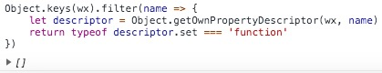

# API Promise化

## 前言

众所周知，前端一大坑就是回调函数。

相信很多人是从`async/await`的温柔乡，掉到小程序重新写回调的大坑里的。

由于开发者工具新增了 [增强编译](https://developers.weixin.qq.com/miniprogram/dev/devtools/codecompile.html) 从而原生支持了`async\await`，避免了我们仍需通过webpack等第三方打包工具实现。因此我们需要做的就是将官方API的 **异步调用** 方式改成 **Promise的方式** 即可。

## 分析与实践

大致上可以有两种思路，第一种就是，逐个函数封装：

```js
let promisify = func => args => new Promise((resolve, reject) => {
    func(Object.assign(args, {
        success: resolve,
        fail: reject,
    }))
})

let _login = promisify(wx.login) // 将wx.login转成Promise形式的方法

_login().then(res => console.log)
```

这种方式比较麻烦，每次调用都需要手动转换。

### 劫持WX

第二种就类似`Page`封装那样，劫持`wx`对象，进行全局统一封装。但有一点比较棘手的是，需要分析清楚哪些是函数，哪些函数是异步而不是同步的，一开始我的思路是这样的：

- 同步方法是以`Sync`结尾的
- 通过`typeof`判断是否为函数

```js
// promisify.js

let originalWX = wx
let props = Object.keys(wx)

for (let name of props) {
    let fn = wx[name]

    if (typeof fn === 'function' && !name.endsWith('Sync')) {
        wx[name] = promisify(fn)
    }
}
```

尝试封装之后，发现报错了。因为`wx.drawCanvas`只有`getter`没有`setter`，无法给它赋值。相当于这个方法是`readonly`。


既然存在没有`setter`的方法，那么我看有多少方法是有`setter`的：

```js
Object.keys(wx).filter(name => {
    let descriptor = Object.getOwnPropertyDescriptor(wx, name)
    return typeof descriptor.set === 'function'
})
```

结果是`[]`，相当于无法改变`wx`对象的每个属性值。



### 复制模式

虽然`wx`的属性都是`readonly`，不能劫持`wx`，但我发现`wx`是`writable`的。

那么可以采用复制模式，将它的所有异步方法拷贝一份并`promisify`之后赋值到新对象，最后再将整个对象赋值给`wx`即可：

```js
let props = Object.keys(wx)
let jwx = {}

for (let name of props) {
    let fn = wx[name]

    if (typeof fn === 'function' && !name.endsWith('Sync')) {
        jwx[name] = promisify(fn)
    } else {
        jwx[name] = fn
    }
}

wx = jwx
```

这种方式虽可行，但是挺冗余的，因为将很多可能没用上的方法也进行了`promisify`。

### 代理模式

熟悉ES新特性的读者应该知道`Proxy`。

它可以用来定义对象的自定义行为，顾名思义，就是给对象挂上`Proxy`之后，对这个属性的任何行为都可以被代理。

那么我们就可以给`wx`挂上代理：

```js
let originalWX = wx
wx = new Proxy({}, {
    get(target, name) {
        if (name in originalWX ) {
            let fn = originalWX[name]
            let isSyncFunc = name.endsWith('Sync') // 同步函数 
            let isNotFunc = typeof fn !== 'function' // 非函数

            if (isSyncFunc || isNotFunc) return fn

            return promisify(fn)
        }
    }
});
```

代理的方式虽解决了复制模式的冗余问题，但是仍有一个问题待解决：异步方法的判断。

在实践中，我发现并不是所有同步方法都是以`Sync`结尾的。比如：`wx.getMenuButtonBoundingClientRect`。

因此打算手动维护一个同步方法列表，将这项方法过滤掉：

```js
let syncFuncList = ['getMenuButtonBoundingClientRect']
// name为函数名
let isSync = name.endsWith('Sync') && !syncFuncList.includes(name)
```


## 优化

考虑到要兼容已上线的小程序，若匆忙替换`wx`，必会导致全局报错，因此可以如下处理：

当用户调用API时，如果传入了`success`、`fail`、`complete`等回调方法的话，则仍继续使用回调的方式继续执行。那么`promisify`可以如下优化：

```js
let originalWX = wx
let hasCallback = obj => {
    let cbs = ['success', 'fail', 'complete']
    return Object.keys(obj).some(k => cbs.includes(k))
}
wx = new Proxy({}, {
    get(target, name) {
        if (name in originalWX ) {
            let fn = originalWX[name]
            let isSyncFunc = name.endsWith('Sync') // 同步函数 
            let isNotFunc = typeof fn !== 'function' // 非函数

            if (isSyncFunc || isNotFunc) return fn

            return (obj) => {
                if (hasCallback(obj)) return fn(obj)
                return promisify(fn)(obj)
            }
        }
    }
});
```

> 由于本文的前提是开启 **增强编译**，而该模式下也新增支持`Array.prototype.includes`，因此可以放心使用该ES7的新特性。

## 后续

由于发现了微信官方也提供了一个 [API Promise化](https://developers.weixin.qq.com/miniprogram/dev/extended/utils/api-promise.html) 的工具类库，因此增加了本章节。

通过阅读源代码，发现官方的工具类库提供两个方法：`promisify` 和 `promisifyAll`

其中`promisify`与前文的同名方法是几乎一致的。而`promisifyAll`则是接收两个参数，第一个是被封装的对象，第二个则是封装之后的对象，如下使用将和前文我提到的封装方式类似：

```js
import { promisifyAll } from 'miniprogram-api-promise';

let jwx = {}

promisifyAll(wx, jwx)

wx = jwx
```

另外还有一点需要提到的是，官方这个工具类库，判断是否为异步函数的方式是维护了一个异步方法列表，会存在遗漏新API的可能。

相当于我的做法是黑名单机制，而官方采用了白名单机制。

> 另外需要注意的是，开发者工具记得打开 **增强编译**