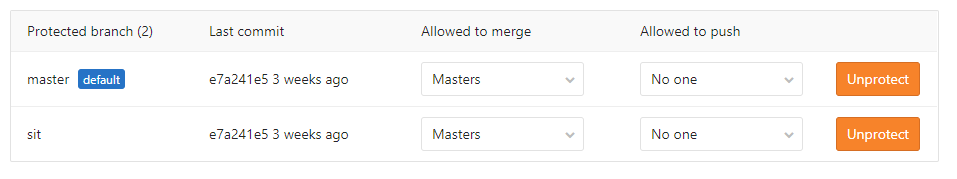
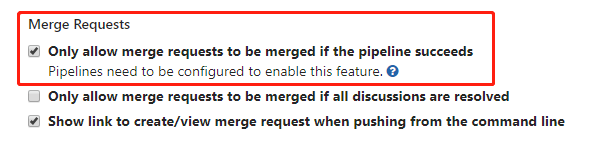

# 编码规范的一些思考

## 引言

古人常说，无规矩不成方圆。在编程的世界里也同样如此。

从编程语言，到文件的命名，再上升到项目结构都可以提供相关的规范。

然而，规范的落地往往都会晚于项目的启动，因此每个团队都会有历史代码需要处理，这是工程师无法逾越，也是心中无法抹去的痛苦。

## 现实

在笔者呆过的团队，似乎都在重蹈覆辙：
- 一开始不重视文档、规范，快速启动，敏捷开发
- 等团队日益壮大，开始制定规范，而此时已经存在大量的历史遗留的问题代码
- 由于团队会有些人员变动，因此会出现一些无人认领的孤儿代码

如此往复，无形中浪费了许多因修复历史代码而产生的工作量。

笔者认为，有可能是以下几种原因导致这种现象：

- 团队早期人员少，项目急，人力不足
- 前端开发仍不够成熟，没可落地的完整方案
- 经验不足，无法意识到规范的重要性

## 范围

我们常说的代码规范属于编码规范的子集。

笔者理解的编码规范包括一下几种：
- 代码规范
- 文件规范
- 项目结构规范

其中，**代码规范** 并不是编写有效的代码硬性规定，而是统一代码风格、避免出错的最佳实践。

代码规范往往含有主观性（比如在JavaScript是否需要分号），孰是孰非可以讨论很久，因此建议小范围投票，快速决定，坚决执行即可。

**文件规范** 则包含：文件的命名规范，以及文件的类型规范（如图片）。

**项目结构规范** 是规范化项目的结构，有利于项目的可读性。

由于篇幅有限，文本将主要阐述 **代码规范** 的制定与落地实施。

## 前端的特殊性

若是其他岗位，可能就涉及一种编程语言，因此确定一种代码规范即可。

但是前端，涉及到编程语言相对较多，并且不同框架或者runtime也可能导致不同的语法风格，因此需要覆盖的规范也比较多：

- 编程语言：JavaScript、CSS、HTML
- 框架：Vue、React、Angular
- runtime：Node.js、小程序、浏览器
- 语法糖：CoffeeScript、TypeScript

其中JavaScript是一种极度灵活，约束较少，弱类型的动态编程语言，也是前端开发的主要语言。如果不对编码的风格做一定的约束，必然出现千差万别的风格，虽然都是正确可执行的代码，但这会让代码的可阅读性非常差。

上述的runtime和语法糖都是针对于`JavaScript`而言，因此确定`JavsScript`的代码规范是首要任务。

> 最好的结果就是每个人写得代码都是一样的。

## 快速开始

导致团队的代码规范难以指定的一个很大原因就是无法快速开始。

因此笔者提供一种思路：工具驱动规范(Tool Drive Specification)

通过现有的代码检测工具，反向推到出代码的规范，即有可实施的检测工具，又有了现成的文档，一举两得。

对于`JavaScript`来说，最强力的代码分析检测工具非`ESLint`莫属，其涵盖了代码质量和编码风格的检测。

### ESLint


ESLint官方有提供一个推荐方案，通过配置文件`.eslintrc`：

```json
{
    "extends": "eslint:recommended"
}
```

或者采用业界比较出名的公司规范也可以，比如：Google、Airbnb。

使用`ESlint --init`即可开启交互式初始化ESLint配置。

对于不同的runtime、语法糖和框架而言，都可以使用ESLint作为检测工具，其中的差异则是需要依赖不同的第三方插件来扩展检测能力。以下以团队的首选框架`Vue`举例说明：

`Vue`官方提供了ESLint的插件：[eslint-plugin-vue](https://eslint.vuejs.org/)

通过此插件，可以利用ESLint检测`.vue`文件的`<template>`和`<script>`模块，检测语法错误，以及编码风格。同样地，插件也有推荐的配置：

```json
{
    "extends": "plugin:vue/vue3-recommended",
    "rules": {

    }
}
```

> 另外，可以在`rules`里覆盖推荐的规范

执行检测：

```bash
npx eslint **/*.{js,vue}
```

### HTMLHint


因为`HTML`不算真正的编程语言，而是标记语言，因此可以检测的规范不会太多，因此可以手动梳理一便，同时也支持自定义规则。全部的规则：[HTMLHint Rules](https://github.com/htmlhint/HTMLHint/wiki/Rules)

通过配置文件`.htmlhintrc`配置，默认配置如下：

```json
{
   "tagname-lowercase": true,
    "attr-lowercase": true,
    "attr-value-double-quotes": true,
    "doctype-first": true,
    "tag-pair": true,
    "spec-char-escape": true,
    "id-unique": true,
    "src-not-empty": true,
    "attr-no-duplication": true,
    "title-require": true
}
```

执行检测：

```bash
npx htmlhint **/*.html
```

### stylelint


`stylelint`是`CSS`的代码分析工具，类似于`ESLint`，`stylelint`也提供了 **标准配置(standard configuration)**，安装方式：

```bash
npm install --save-dev stylelint stylelint-config-standard
```

在项目根目录创建配置文件`.stylelintrc.json`：

```json
{
  "extends": "stylelint-config-standard"
}
```

执行检测：

```bash
npx stylelint "**/*.css"
```

## 实施方案

如果只是制定的代码规范文档，但是没有可实施方案，依靠人为的自觉，必然出现不遵守规则的漏网之鱼。因此，必须落地实施方案，拒绝不符合规范的代码合入代码仓库。以`GitLab`举例：

每个仓库均可设置多个分支，在`GitLab`上对关键分支（比如`master`）的权限做严格把控，比如：

- 不允许任何人直接push到关键分支（Allowed to push: No one)



- 仅允许通过pipeline的 **合并请求(merge requests)** 进行合并



最后在pipeline中添加一个Job：执行以上检测脚本。如果代码有不符合规范，则会直接报错从而终止代码继续合并。

## 总结

编码规范的重要性在团队建设的前期，往往容易被忽略，带来的后果是需要消耗更多的时间去掩埋一开始挖的坑。并且在无规范的混沌时期，不同的代码风格导致的代码可读性下降，会无形中加重了开发的负担，降低了开发效率。

另外，需要切记的是，规范文档的落地不一定需要正式的`word`格式，`markdown`、`html`乃至于配置文件的格式都是可以接受的。重要的是代码规范有落地的检测工具。