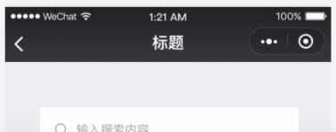
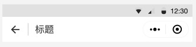

# 自定义导航栏

小程序早期版本（微信客户端6.6.0）仅支持全局设置自定义导航栏。只能统一设置，不能页面单独设置。直到微信客户端7.0.0发布之后，开始支持页面设置自定义导航栏，这让许多大型的小程序逐渐改成自定义导航栏成为了可能。

> 自定义导航栏：下图黑色部分导航栏不再默认显示，从而整个手机页面都成为小程序的渲染区域



## 作用

最大的作用就是可以全屏展示，如我的小程序可以展示壁纸的真实效果，不再受导航栏限制。


其次，可以客制化导航栏，如在后退按钮旁，新增别的按钮，也可以实现后退监听。

需要注意的是，右上角胶囊按钮无法消除，是永久展示的。因此在自定义导航栏的时候，需要考虑与其对齐。可以通过`wx.getMenuButtonBoundingClientRect`获取胶囊按钮的布局位置信息。

## 布局信息

由于开启自定义导航栏之后，全屏界面可渲染，因此如果要客制化导航栏的话，需要知道导航栏的布局信息。



如上图所示，以Android为例。较深色部分为 **状态栏(statusBar)**，可以通过`wx.getSystemInfo`获取系统信息，其中的`statusBarHeight`即是状态栏的高度。

另外前文也提到了，胶囊按钮的信息可以通过`wx.getMenuButtonBoundingClientRect`获取。胶囊按钮与状态栏的距离可以这样计算：

```js
let mb = wx.getMenuButtonBoundingClientRect();
let sh = wx.getSystemInfoSync().statusBarHeight // 为getSystemInfo的同步版本

let distance = mb.top - sh
```

基于胶囊按钮是在导航栏的中间，因此胶囊按钮距离导航栏的底部距离和上面的`distance`是一致的。所以，导航栏的高度是：

```js
let nh = mb.height + distance * 2 // navigatorHeight
```

总计一下，导航栏的布局信息如下：

```js
let navigator = {
    top: sh
    bottom: mb.bottom + distance
    left: 0,
    right: 0,
    height: mb.height + distance * 2
    width: wx.getSystemInfoSync().screenWidth
}
```

## 兼容问题

前文提到页面设置导航栏是要求`客户端7.0.0以上`；

另外计算 **状态栏高度(statusBarHeight)** 需要`基础库版本1.9.0`以上；

计算胶囊按钮的布局信息`wx.getMenuButtonBoundingClientRect`则要求`基础库2.1.0`；

> 由于微信客户端7.0.0发布日期是2018.12.22，而此时的最新基础库版本为`2.4.3`

因此，只要判断当前用户的客户端是否为`7.0.0`或以上即可。

## 注意事项

由于设置了自定义导航栏，全屏成了渲染区域。因此需要注意`position: fixed`的元素，此时应该将`top`对应的数值加上`statusBarHeight`和`navigator.height`，才能渲染正确。