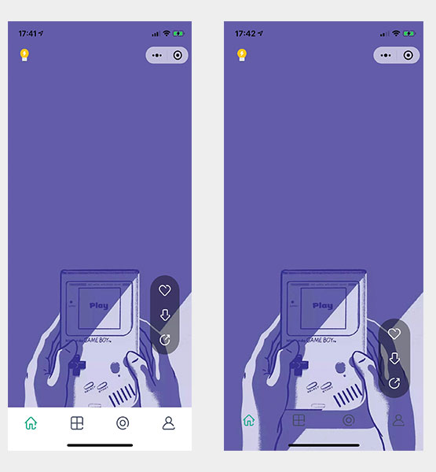

# 自定义tabbar

## 前言

由于打算在首页全屏展示壁纸，但是首页属于tabbar页面之一，会被底部的tabbar遮挡一部分。

因此要考虑使用新特性：自定义tabbar。可以看下前后效果对比：



## 分析

原本想着自行写个组件渲染即可，但看到官方有提供自定义tabbar，那么就优先使用官方提供的吧。

从 [小程序的官网文档](https://developers.weixin.qq.com/miniprogram/dev/reference/configuration/app.html#tabBar) 可以看到，自定义tabbar依赖基础库2.5.0以上，相关配置如下：

```json
"tabbar": {
    "custom": true
}
```
 
设置了`custom`之后，小程序不再渲染原有的tabbar，开始渲染自定义tabbar。

而这个自定义tabbar的组件则需要自己写（感觉好像绕回来了）

## 实践

按照官网文档的描述，在根目录上创建组件的文件夹，命名`custom-tab-bar`，里面的文件和正常的组件保持一致。

此时就可以将组件的样式和逻辑稍作调整：

- 当进入首页时，背景色改成透明
- 进入其他页面，背景色改回白色

这里需要注意的是，并不是多个页面渲染同个tabbar组件，而是每个页面独自渲染各自的tabbar，但不需要在每个页面的`WXML`里显式引用。

### 选中态

由于每个页面都各自渲染了tabbar组件，而这个组件的初始化时，都将设置第一个tab为选中态。因此存在这样的问题：tabbar如何正确显式当前的选中态？

根据官网的描述，即是提供了接口`getTabBar`，可以获取tabbar的实例。在当前页面下，手动setData更新选中态（这不就很蠢）

需要在tabbar包含的每个页面的onShow里这样设置：

```js
Page({
    onShow() {
        if (typeof this.getTabBar === 'function') {
            this.getTabBar().setData({ selected: 0 }) // 0代表第一个
        }
    }
})
```

> 此时如果能监听到路由的变化，那么可以统一处理。后续考虑封装个Router

### 兼容性

为了测试兼容性，我尝试将基础库调至2.5.0以下。此时，自定义tabbar和原有的tabbar都没有渲染。通过多方测试，发现只有去掉`custom:true`才会恢复渲染tabbar。

所以，如果对兼容性要求比较高的小程序，应该避免这个坑。采取自行实现组件，自行引用的方式实现自定义tabbar。

> 如果你知道有什么兼容办法，欢迎和我联系。