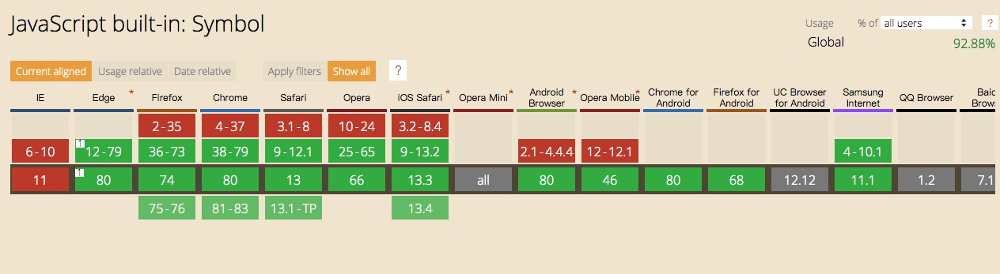
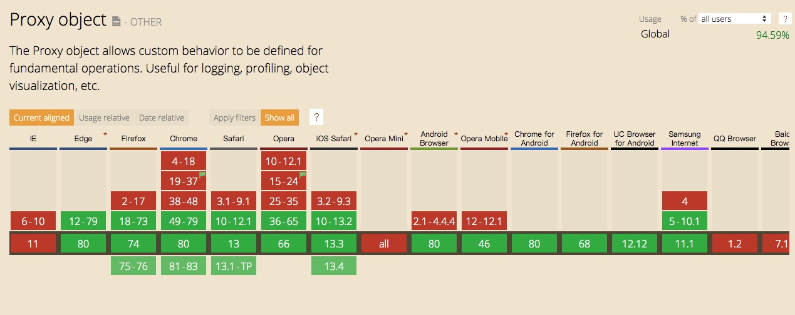

# 全局变量的管理

## 前言

> 在浏览器的环境下有一个全局变量：`window`。
若定义变量时，遗漏了`var`，此时声明的变量就变成了全局变量，自动挂载到`window`下，可当做`window`的属性来访问，也可以直接访问。

小程序的底层也是通过Web实现的，因此同样存在`window`对象，但是微信团队做了些处理：


微信团队将`window`设置成了`writable:false`，且值也为`undefined`。

即我们无法像在`web`那样任意声明全局变量。但微信团队提供了其他的全局变量，比如常用的`wx`、`global`。

## 问题

虽然`window`是只读的，但是`global`是可写的:


因此常见的做法，就是将需要全局访问的变量都保存到`global`下，间接声明了全局变量。

全局变量的污染，在小团队的项目里可能没什么感知。但是在一个大型的项目里，是非常常见的，一不小心就将别人声明的变量覆盖了。

另外如果可以随意注册全局变量，又不加以管理的话，有可能会导致内存泄漏，最终导致应用闪退。

> 同理，setStorage也存在同样的问题。

## 思考

简单地将这些变量改成`readonly`肯定是不可取的，这影响了日常的开发。

在早期的前端开发中，也有同样类似的全局变量污染的问题，我依稀记得两种解决方案：

- 命名空间
- 模块化

其中 **模块化** 明显不是这个问题的解决方案。因为目前的确是需要全局变量的，问题只是如何避免污染和管理全局变量而已。

因此 **命名空间** 是可以深入探索的思路。

## 实践

### 命名空间

命名空间是一种常用的代码组织形式。

大致做法是，先通过命名分配空间，再使用空间。

> 我的习惯是，用业务或者功能来命名空间

```js
global.localStorage = {
    doSet() {},
    doGet() {},
    doClear() {}
}

global.util = {
    format() {},
    valide() {}
}
```

命名空间是通过互相约定的方式来工作的，因此仍然会存在覆盖的问题。

### Symbol

`Symbol`是ES2015中新增的基本数据类型。这个类型有个特别之处，每个`Symbol()`返回的值都是独一无二的，举个例子：

```js
Symbol('foo') === Symbol('foo') // false
```

因此通过`Symbol`的方式，可以完美避免变量被覆盖：

```js
// car.js
let car = Symbol()
global[car] = {}

// health.js
let health = Symbol()
global[health] = {}
```

由于每个`Symbol`返回的值是唯一的，因此这个`Symbol`可以单独保存，以便各个文件引用。

> 由于 `Symbol` 属于新特性，因此需要关注下兼容性



### 管理声明

通过`Symbol`的方式解决了变量的污染问题，但仍然无法对全局变量的声明进行管理。

我想到的办法就是给 `global` 增加个代理，对 `global` 的任何操作，都先经过代理检测，这样就有了强力的保障。

因此，可以使用新特性：`Proxy` 来监听 `global` 的变更，举例说明：

```js
global = new Proxy(global, {
    set(obj, prop, val) {
        if (prop in obj) {
            throw new TypeError(`${prop}: 该属性已定义！`)
        }

        // 可以做其他策略
        // 或者上报数据，让你知道有哪些人偷偷定义了全局对象
        obj[prop] = val
        return true
    },
})
```

> 由于 `Proxy` 属于新特性，因此需要关注下兼容性



## 总结

使用 `Proxy` 之后，能对 `global` 的各种操作（设置属性，设置原型等13种操作）进行监控，即能避免重复定义变量，也可以很好的管理全局变量，两全其美。