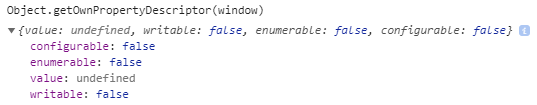
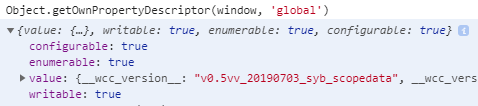
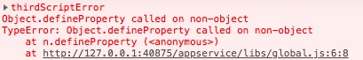

# 全局变量的管理

## 前言

> 在浏览器的环境下有一个全局变量：`window`。
若定义变量时，遗漏了`var`，此时声明的变量就变成了全局变量，自动挂载到`window`下，全局都可以通过`window`来访问，或者直接访问。

小程序的底层也是通过Web实现的，因此同样存在`window`对象，但是微信团队做了些处理：



微信团队将`window`设置成了`writable:false`，即我们无法任意声明全局变量。但前面的引言也说了，`window`下的属性，也是可以直接访问，因此也可以当做全局变量来看待，比如常用的`wx`、`global`。

## 问题

虽然`window`是只读的，但是`window`下的属性是可写的，比如`global`:



因此常见的做法，就是将需要全局访问的变量都保存到`global`下，间接声明了全局变量。

全局变量的污染，在小团队的项目里可能没什么感知。但是在一个大型的项目里，是非常常见的，一不小心就将别人声明的变量覆盖了。

另外如果可以随意注册全局变量的话，有可能会导致内存泄漏，最终导致应用闪退。

> 同理，setStorage也存在同样的问题。

## 思考

简单地将这些变量改成`readonly`肯定是不可取的，这影响了日常的开发。

在早期的前端开发中，也有同样类似的全局变量污染的问题，我依稀记得两种解决方案：

- 命名空间
- 模块化

其中 **模块化** 明显不是这个问题的解决方案。因为目前的确是需要全局变量的，问题只是如何避免污染和随意声明而已。

因此 **命名空间** 是可以深入探索的思路。

## 实践

### 命名空间

命名空间是一种常用的代码组织形式。

大致做法是，先通过命名分配空间，再使用空间。

> 我的习惯是，用业务或者功能来命名空间

```js
global.localStorage = {
    doSet() {},
    doGet() {},
    doClear() {}
}

global.util = {
    format() {},
    valide() {}
}
```

命名空间是通过互相约定的方式来工作的，因此仍然会存在覆盖的问题。

### Symbol

`Symbol`是ES2015中新增的基本数据类型。这个类型有个特别之处，每个`Symbol()`返回的值都是独一无二的，举个例子：

```js
Symbol('foo') === Symbol('foo') // false
```

因此通过`Symbol`的方式，可以完美避免变量被覆盖：

```js
// car.js
let car = Symbol()
global[car] = {}

// health.js
let health = Symbol()
global[health] = {}
```

由于每个`Symbol`返回的值是唯一的，因此这个`Symbol`可以单独保存，以便各个文件引用。

### 收敛权限

通过`Symbol`的方式解决了变量的污染问题，但随意声明的问题仍在。因此可以通过收敛设置权限的方式来处理。

通过收敛 `global` 的 `setter` 函数，收敛 `global` 的设置权限。

### setProperty

本想通过`Object.setProperty`来设置`global`的描述符（报错了）：

```js
// global.js

let originalGlobal = JSON.parse(JSON.stringify(global))

Object.defineProperty(window, 'global', { // throw error
    get() {
        return originalGlobal
    },
    writable: false
})
```



报错了，说明`window`不是个对象，反而是`undefined`。将`window`改成`this`同样不行。

### 原型链

既然无法设置`global`的描述符，那我想到了通过原型链来实现。

首先用`Object.seal`将`global`封闭，然后设置global的原型链：

```js
// global.js
let galaxy = Object.create(null)

Object.seal(global)

global.__proto__ = galaxy

module.exports = {
    setData(key, val) {
        galaxy.key = val
    }
}
```

## 总结

通过收敛权限之后，可以设定一些设置属性的规则，从而达到控制全局变量的作用。