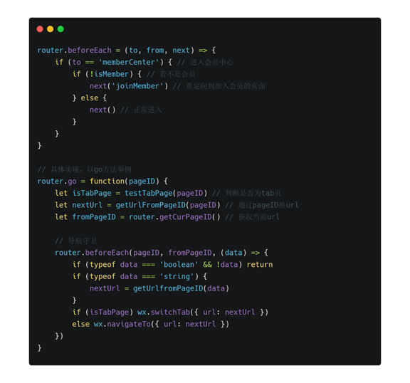
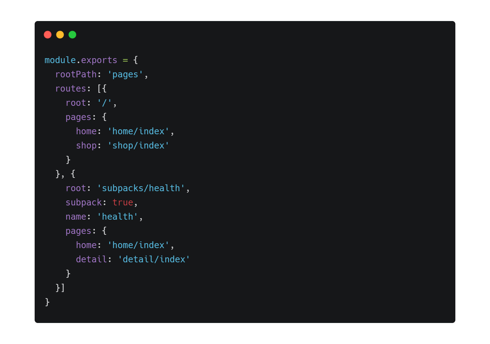
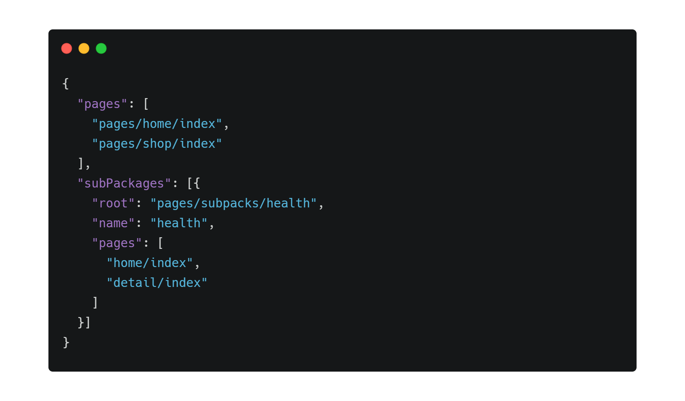
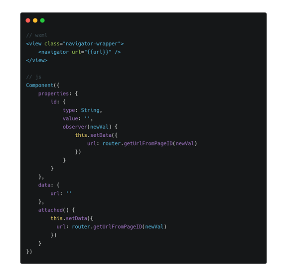

# 浅谈小程序路由的封装设计

微信官方提供了基础的路由能力，在日常的开发中虽已够用，但随着开发的深入，会遇到许多值得思考提炼的问题。本文将探讨作者在微信小程序（以下简称小程序）开发当中遇到的问题，以及解决方案设计。

参考“WHY-HOW-WHAT"黄金圈思维法则，首先讲述为什么小程序的路由需要封装设计，也就是存在哪些问题，需要封装处理？

## 存在的问题

### 路由跳转的路径与文件路径耦合

小程序的路由跳转使用的是真实文件路径，因此若文件的结构发生变化，必会影响到所有的页面的跳转路径。

笔者在实际开发中就遇到这个问题，以小程序分包举例。

小程序的分包是以文件夹为单位的。如果要将一系列的页面拆分成分包，则需要将这些文件移至同个目录之下，因此必然导致路由的跳转路径发生变更。如果此时路由跳转均是直接通过文件路径跳转的话，则需要全局改动，导致的工作量不少。

另外，当开发团队比较庞大时，不同的业务之间总会存在互相跳转的情况。当其中一个页面地址发生变更时，其他业务跳转到该页面的路径都需要手动变更。若此时通知不及时，或者遗漏了一些地方，导致跳转失败，终会酿成大错。

### 路由传参

目前小程序支持的传参方式，即通过跳转路径上的query查询参数。

通过query传参的问题，与在Web上URL传参是一致的，比如：

- query的参数长度有限
- query只能传递可序列化的数据
- 导航前需手动序列化，到达目标页面后需反序列化

### 条件守卫

在日常业务中，会存在一些页面需要一定条件才允许进入的。

举个例子，会员服务是一种很常见的能力，而会员中心的进入条件是：

- 该用户已经完成登录
- 该用户是本产品的会员

一般情况下，这种有特定准入资格的页面的导航逻辑是这样的：


这种方式简单明了，但存在一个问题：需要每次跳转前主动判断，逻辑冗余以外，还可能被遗漏。

## 思路

由于小程序本身已提供了基础的路由导航能力，不像`react`、`vue.js`那样需要从底层进行封装，从而提供路由能力。但是，本质上小程序可以理解成类`vue.js`这样的框架，因此可以从`vue.js`的路由库`vue-router`上找到灵感，从而解决以上问题。

### 命名路由

使用 **命名路由** 的方式可以解决前文提及的跳转路径和文件真实路径耦合问题。

通过`Map`来映射 **页面ID** 和 **页面地址**，路由跳转时，仅能使用 **页面ID** 进行路由跳转。

下面以导航至首页举例：

```js
// before
wx.switchTab('pages/home/index')

// after
router.go('home')
```

> 由于小程序有tab页面和普通页面之分，因此导航至tab页时需使用switchTab

细心的读者可能会发现上文使用了`go`方法，而不是`switchTab`。其实，具体哪些页面属于tab页面，在`app.json`已经明确配置。对于使用者来说，不需要关心跳转的页面是属于哪种类型，这些细节都应该统一在底层封装好。下面罗列`Router`与官方API的对应关系：


> Router API的设计原则是保持简单，以及尽量保持与web规范一致

### 传递参数

微信官方提供的query方式传参，若参数是普通数据类型（如`Number`、`String`）时可以直接使用；但若是涉及到复杂数据类型（如`Array`、`Object`）时，需要先做序列化处理，当数据较为庞大时，性能的损耗还是比较明显的。

因此，在内存上传递参数是比较便利且容易想到的办法。

利用数据字典，将`页面ID`作为`key`、传递的参数作为`value`，写入`Router`的`state`：

```js
router.go = function(pageID, params) {
    // do something...
    router.state[pageID] = params
}
```

在目标页面上，可以通过`router.getParams()`方法，获取传递的参数。

> 由于采用了命名路由的方式，可以使用`页面ID`作为`key`，避免了使用跳转路径做`key`时，涉及到的绝对与相对路径问题。

### 条件导航

条件导航可以使用类似vue-router的导航守卫来解决问题。

由于路由的能力是微信官方提供的，因此无法像 vue-router 那样提供多类型的导航守卫，但仅有全局导航守卫也足够使用。

以下仍以“会员中心”的进入逻辑举例，并简要介绍实现思路：



其中，`to`和`from`目前是`pageID`，其实可以封装更多信息，以保证导航守卫可以尽可能拥有更多的信息。因此`to`可以理解成是即将进入的页面路由对象，而`from`则是当前正要离开的路由对象。

路由对象包含：
- `pageID`：页面ID
- `path`：页面ID对应的path
- `params`：传递的参数
- `query`: URL的查询参数

### 配置信息

由前文提到的 **命名路由** 做法需要一个配置文件来关联`页面ID`与`页面路径`的关系。

页面的配置信息，则是使用`router.config.js`设置，然后通过构建工具编译转成`app.json`。

以下是`route.config.js`：



> 其中，跳转首页则是`router.go('home')`；而跳转分包`health`的首页则是使用`router.go('health.home')`

通过以上的配置文件，使用构建工具转换成微信官方可识别的`app.json`配置：



### 辅助函数

在日常开发当中，经常会用到一些和路由相关的通用辅助函数，如获取当前页面，获取上个页面等。这些辅助函数都应该统一抽象封装，避免代码冗余。

```js
router.utils = {
    getCurPage() { // 获取当前页面信息
        let pages = getCurrentPages()
        let len = pages.length
        
        return pages[len - 1]
    },

    getPrePage() {}, // 获取上个页面信息

    getParams() {}, // 获取传递的参数

    getPageID(path) {} // 通过path找到pageID
}
```

### navigator组件

微信官方除了提供`API`用于导航以外，还提供了`navigator`组件。

> 另外还有`functional-page-navigator`是用于插件当中，不能在小程序包使用，因此本文暂且将其忽略。

由于`navigator`的跳转参数仍是使用`path`，因此笔者将其进行二次封装，改造成可以通过`pageID`跳转:



## 总结

由于小程序相对比较封闭，因此在路由上能做的东西比较有限。

但路由又与许多概念有千丝万缕的关系。比如路由与文件结构关联，而文件结构又影响到分包的设计，环环相扣，影响到的地方则会越来越多。

因此，能提前看到本文提到的可能出现的问题，也许对后续的小程序开发有一定的参考意义。

另外，前文提到的很多问题，在早期开发，或者没有深入开发之前，都不会遇到。但是当你开始经历前文提到的那些问题时，往往此时的改造成本已经很大了。因此希望本文能给你带了一些启发，在早期规避这些问题，那本文的使命就达到了。