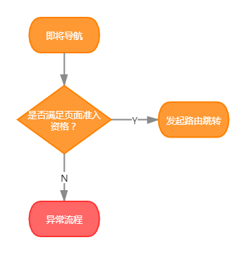
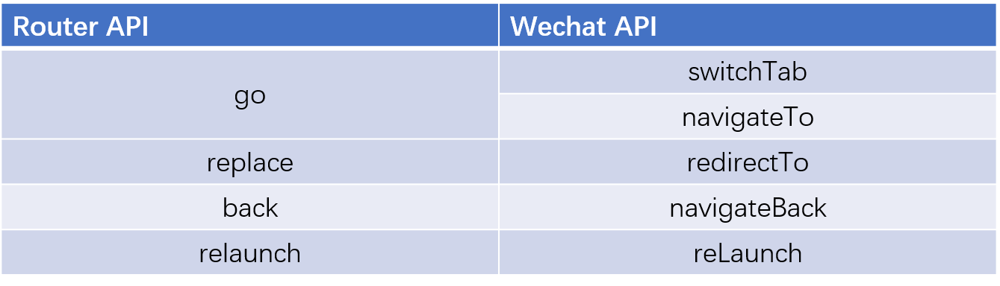

# 小程序路由的设计

微信官方提供了基础的路由能力，在日常的开发中虽已够用，但随着开发的深入，会遇到许多值得思考提炼的问题。本文将探讨作者在微信小程序（以下简称小程序）开发当中遇到的问题，以及方案设计。

小程序的页面路径和文件的路径强耦合，像极了早期的Web时代，URL也是和文件路径强关联的。

这样让小程序的早期设计比较简单明了，但是随着开发的深入，暴露了许多明显的问题。因此，对于小程序路由进行封装，可以说是很有必要的。

根据思维模式 “WHY-HOW-WHAT"黄金圈法则，先讲一下WHY，也就是为什么需要封装路由。

## 存在的问题

### 路由跳转的路径与文件路径耦合

小程序的路由跳转使用的是真实文件路径，因此若文件的结构发生变化，必会影响到所有的页面的跳转路径。

笔者在实际开发中就遇到这个问题，以小程序分包举例。

小程序的分包是以文件夹为单位的。如果要将一系列的页面拆分成分包，则需要将这些文件移至同个目录之下，因此必然导致路由地址发生变更。如果此时路由跳转均是直接通过文件地址跳转的话，则需要全局改动，工作量不少。

另外，当开发团队比较庞大时（如我所在团队50+前端开发专注一个小程序），不同的业务之间总会有千丝万缕的关系。当其中一个页面地址发生变更时，其他业务跳转到该页面的地址都需要手动变更。若此时通知不及时，或者遗漏了一些地方，导致跳转失败，终会酿成大错。

### 路由传参

目前小程序支持的传参方式，即通过跳转地址的query字符串。

通过query传参的问题，在Web上是经历过了的。在Web上除了query还可以借用`History API`传参，解决了以下问题：

- query的参数长度有限（具体限度是多少还没尝试过），而`History API`则无限制。
- query只能传递可序列化的数据，而`History API`无限制。

### 导航守卫

在日常业务中，会存在一些页面需要一定条件才允许进入的。

举个例子，会员服务是一种很常见的能力，而会员中心的进入条件是：

- 该用户已经完成登录
- 该用户是本产品的会员

一般情况下，这有特定准入资格的页面的导航逻辑是这样的：



这种方式简单明了，但存在一个问题：需要每次跳转前主动判断，逻辑冗余以外，还可能被遗漏。

通过 **导航守卫** 的方式，在全局上注册“守卫”来保护导航，收拢“守卫”的逻辑，保证代码整洁的同时，还增加了导航的安全性。

## 思路


### 命名路由

使用 **命名路由** 的方式可以解决前文提及的跳转路径和文件真实路径耦合问题。

通过`Map`来映射 **页面ID** 和 **页面地址**，路由跳转时，仅能使用 **页面ID** 进行路由跳转。

下面以导航至首页举例：

```js
// before
wx.switchTab('pages/home/index')

// after
router.go('home')
```

> 由于小程序有tab页面和普通页面之分，因此导航至tab页时需使用switchTab

细心的读者可能会发现上文使用了`go`方法，而不是`switchTab`。其实，具体哪些页面属于tab页面，在`app.json`已经明确配置。对于使用者来说，不需要关心跳转的页面是属于哪种类型，这些细节都应该统一在底层封装好。下面罗列`Router`与官方API的对应关系：



> Router API的设计原则是保持简单，以及尽量保持与web规范一致

### 传递参数

微信官方提供的query方式传参，若参数是普通数据类型（如`Number`、`String`）时可以直接使用；但若是涉及到复杂数据类型（如`Array`、`Object`）时，需要先做序列化处理，当数据较为庞大时，性能的损耗还是比较明显的。

因此，在内存上传递参数是比较便利且容易想到的办法。

利用数据字典，将`页面ID`作为`key`、传递的参数作为`value`，写入`Router`的`state`：

```js
router.go = function(pageID, params) {
    // do something...
    router.state[pageID] = params
}
```

在目标页面上，可以通过`router.getParams()`方法，获取传递的参数。

> 由于采用了命名路由的方式，可以使用`页面ID`作为`key`，避免了使用跳转路径做`key`时，涉及到的绝对与相对路径问题。

### 导航守卫

由于路由的能力是微信官方提供的，因此无法像 `vue-router` 那样提供多类型的导航守卫，但仅有全局导航守卫也足够使用。

全局注册前置导航守卫：

```js
router.beforeEach((to, from) => {
    // do something...
})
```