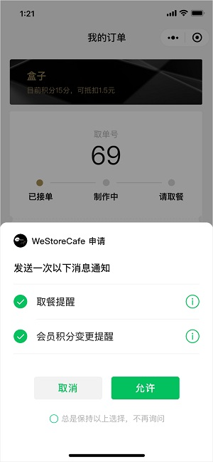

# 订阅消息的思考

## 前言

小程序的早期定位是“即用即走”或者说是“用完即走”。
但小程序的运营者却不是这么想的，希望用户尽可能的停留在小程序上，或者“多回来看看”，俗称“拉回流”。
让用户回流的关键手段就是 **订阅消息**，通过点击订阅消息，可直接回到小程序。

## 背景

早期小程序提供的是 **模板消息**，用户每次点击或者完成支付，都会生成一个`formId`或者`paypay_id`，开发者可以通过这个`formId`给用户发送一次模板消息。

因此，开发者的常规做法：尽可能地在每个按钮上都封装`form`，用以收集`formId`；收集的`formId`并不会使用，而是将它们存到数据库里，在需要拉回流的时候，通过这些`formId`发送模板消息。

这样会存在几个问题：
- 用户会被莫名的骚扰（因为`formId`有7天的有效期）
- 用户收到的模板消息是无预期的（因为`formId`可以发任意的模板消息）
- 开发者在每个页面每个可点击区域都封装了`form`，导致代码混乱

为了解决以上问题，小程序团队就采用了 **订阅消息** 来替换 **模板消息**。

> 小程序模板消息接口于2020年1月10日下线

## 订阅消息

**订阅消息** 与 **模板消息** 相比较，明显的好处是：用户对自己将收到的模板消息类型有一定的预期，如：

从开发者的角度看：订阅消息是使用接口调用([wx.requestSubscribeMessage](https://developers.weixin.qq.com/miniprogram/dev/api/open-api/subscribe-message/wx.requestSubscribeMessage.html))，不再是以前那样，一定要用`Button`。对于代码维护和开发效率来说，都是利好的。

但是，订阅消息仍有个小程序通病，有一定的兼容性，需要基础库2.4.4以上才能使用。这也就意味着，2020年1月10日模板消息下线之后，你没法找回停留在基础库2.4.4以下的用户了。