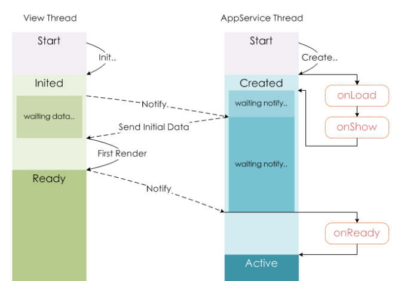

# 组件封装的思考

## 前言

在小程序开发的早期，是没有 **自定义组件(component)**，仅有 **自定义模板(template)** 的。最早接触到组件开发还是在使用 `React`、`Vue` 框架的时候，熟悉以上两个框架的读者，对小程序的组件应该会有熟悉的感觉，机制和写法差不多

## 为什么要有组件？

对于这个问题，很多人的第一反应也许是：代码复用

的确，代码复用是组件的核心职责，但它还有更大的使命：性能

因为通过组件封装，可以将页面拆分成多个组件，因此较大粒度的页面就被拆分成粒度较小的组件。当一些数据发生变更导致页面变化时，就只需要重新渲染包含该数据的组件即可，而不用渲染整个页面，从而达到了提高渲染性能的效果


## 生命周期

在 `Vue` 中，每个页面是一个 `Vue` 实例，而组件又是可复用的 `Vue` 实例，因此可以理解成，页面和组件是相同的生命周期

而小程序就将页面和组件拆分成两个类：`Page` 和 `Component`，因此接收的生命周期函数也是不一样的。比如，`Page` 接收的是：`onLoad`、`onShow`、`onReady`等函数，而 `Component` 则接收 `created`、`attached`、`ready` 等函数

> 命名风格都不一致，真是让人头大



## 数据传递

### Vue

`Vue` 的组件间数据传递的机制是这样的：父组件通过`property`传递数据给子组件，而子组件通过事件通知的形式传递数据给父组件

在页面包含的组件结构还比较简单的时候，这样的机制还是比较好用的。但是，随着业务的复杂度逐渐上升，组件嵌套的层数递增，会出现数据层层传递的困境

为了解决这个问题，`Vue` 推出了 `Vuex` 这样的状态管理工具，集中式存储、管理应用的所有组件的状态。并提出了“单向数据流”的理念：


### 小程序

小程序同样有类似的机制，`property`和事件。此外还提供了获取 **子组件实例** 的方法：`selectComponent()` 和  定义组件间关系的字段 `relations`

其中常用的就是获取子组件实例，比如:

```html
<parent-component>
    <child-component id="child"></child-component>
</parent-component>
```

此时，在`parent-component`组件中可以直接获取`child-component`的实例：

```js
Component({
    attached() {
        let $child = this.selectComponent('#child')

        // $child.doSomeThing()
    }
})
```

## 实战

### 背景

> 制作一个 **对话框(modal)** 组件

也许有的读者会感到困惑，官方不是有提供 `wx.showModal` 可以直接用吗，为什么要重复造轮子

其实，当你的产品想要结合 `Modal` 和 `Button` 的 `open-type` 能力时，你就会明白重复造轮子的必要性以及`wx.showModal`的局限性

### 属性定义

对话框的常见属性可以参考`wx.showModal`

除此以外，其中关键的一个属性就是 表示对话框当前的显示状态：`visible`

此时，有两种选择，第一种是将这个变量存在页面上，通过`property`传递给`Modal`组件；另外一种，就是作为`Modal`组件`data`中的一员

### property传递

通过`property`传递的话，就相当于将 `Modal` 的控制权交到对应的页面，举例：

```html
<!-- home.wxml -->

<modal visible="{{visible}}" />
```

```js
// home.js

Page({
    data: {
        visible: false
    },
    toggleModal() {
        this.setData({ visible: !this.data.visible })
    }
})
```

此时对应的 `Modal`：

```js
// modal.js

Component({
    properties: {
        visible: {
            type: Boolean,
            value: false,
            observer(newVal, oldVal) {
                this.setData({ visible: newVal })
            }
        }
    }
})
```

> 这里和`Vue`框架有个差异，`Vue`对于传进来的property会自动赋值，而小程序则需要自己手动赋值

#### 问题与办法

当 `visible` 这个变量被 `Modal` 和 `Page` 同时使用时，会出现不显示的问题。

为了便于描述，我通过描述真实场景来讲解：

1. 当页面需要显示对话框时，`Page` 传递 `visible=true` 给 `Modal`
2. 经过一段时间之后，用户关闭了对话框，此时 `Modal` 将自身的 `visible` 设置为 `false`
3. 当页面需要再次出现对话框时，`Page` 继续传递`visible=true` 给 `Modal`，**此时发现对话框不会显示**

通过分析可以发现，由于 `Page` 两次传递相同的 `visible=true` 给 `Modal` ，因此第二次传递的时候，被 `Modal` 直接忽略掉了。

这个问题也很好解决，大致思路就是保证每次传递的值不同即可：

- 传递的值前面加上时间戳，组件再将时间戳移除（比较直观，但是不方便）
- 利用对象不相等的机制，数据传递只传对象，不传基础数据类型（比如`{ visible: true } !== { visible: true }`)

### 组件自身属性

这种是我推荐的方案。将 `visible` 属性交由组件 `Modal` 自行管理：

```js
// modal.js

Component({
    data: {
        visible: false
    },
    methods: {
        show() {
            this.setData({ visible: true })
        }
    }
})
```

由于父组件或者当前页面可以直接获取组件的实例，因此可以直接调用组件的`setData`，如：

```js
let $modal = this.selectComponent('#modal')

$modal.setData({ visible: true })
```

但是不建议这样使用，而是组件暴露方法让外部调用：

```js
let $modal = this.selectComponent('#modal')

$modal.show()
```

### 组件的事件

通常，对话框都会有按钮，一个或两个。

因此 `Modal` 需要与父组件通过 **事件(event)** 的方式传递信息：当前点击了取消还是确定按钮：

```html
<!-- home.wxml -->

<modal id="modal" bind:btntap="handleModalTap" />
```

```js
// home.js

Page({
    showModal() {
        let $modal = this.selectComponent('#modal')

        $modal.show()
    },

    // 其他方法

    handleModalTap(e) {
        let { type } = e.detail

        // type = cancel or confirm
    }
})
```

在 `Modal` 的构造函数则是这样的：

```js
// modal.js

Component({
    data: {
        visible: false
    }
    methods: {
        handleBtnTap(e) {
            let { type } = e.target.dataset

            this.triggerEvent('btntap', { type })
        }
    }
})
```

```html
<!-- modal.wxml -->

<view class="wrapper">
    <!-- 省略其他结构 -->
    <view class="foot" bindtap="handleBtnTap">
        <button data-type="cancel">取消</button>
        <button data-type="confirm">确定</button>
    </view>
</view>
```

这样设计 `Modal` 组件，的确可以满足使用，但是不够好用

因为展示对话框时使用的是 `showModal` 而用户操作之后又是通过另外一个方法 `handleModalTap` 反馈的。当一段时间之后回看这样的代码，会发现这种写法存在思维的中断，不利于代码维护

所以，我建议结合 `Promise` 来封装 `Modal`

### 省略事件

由于展示对话框之后，用户必然要操作，因此可以在 `showModal` 的时候，通过 `Promise` 返回对应的操作信息即可

另外，需要引入发布订阅机制（以下使用 `Node.js` 的 `Events` 举例）：

```js
// modal.js

const EventEmitter = require('events');
const ee = new EventEmitter();

Component({
    data: {
        visible: false
    },

    methods: {
        show() {
            this.setData({ visible: true })

            return new Promise((resolve, reject) => {
                ee.on('cancel', () => {
                    reject()
                })
                ee.on('confirm', () => {
                    resolve()
                })
            })
        },

        handleBtnTap(e) {
            let { type } = e.target.dataset

            ee.emit(type)
            this.triggerEvent('btntap', { type })
        }
    }
})
```

此时，在 `Page` 即可这样展示对话框：

```js
// home.js

Page({
    onLoad() {
        let $modal = this.selectComponent('#modal')

        $moda.show().then(() => {
            // 当点击确认时
        }).catch(() => {
            // 当点击取消时
        })
    }
})
```

## 总结

组件是很好用的机制，也是最常用到的能力。因此日常开发中，应该会遇到各种各样组件封装的问题，平时遇到应该多思考总结一下，对团队和自己都很有帮助！