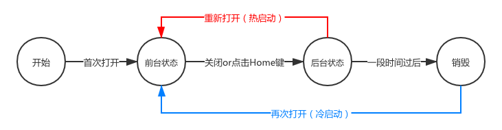
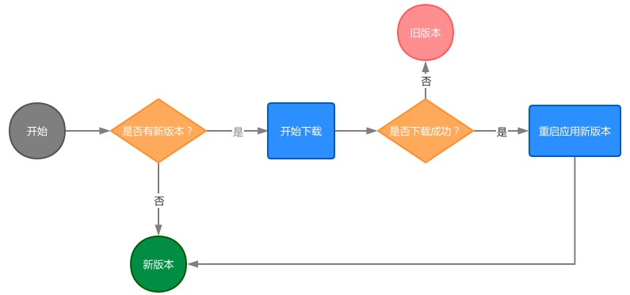
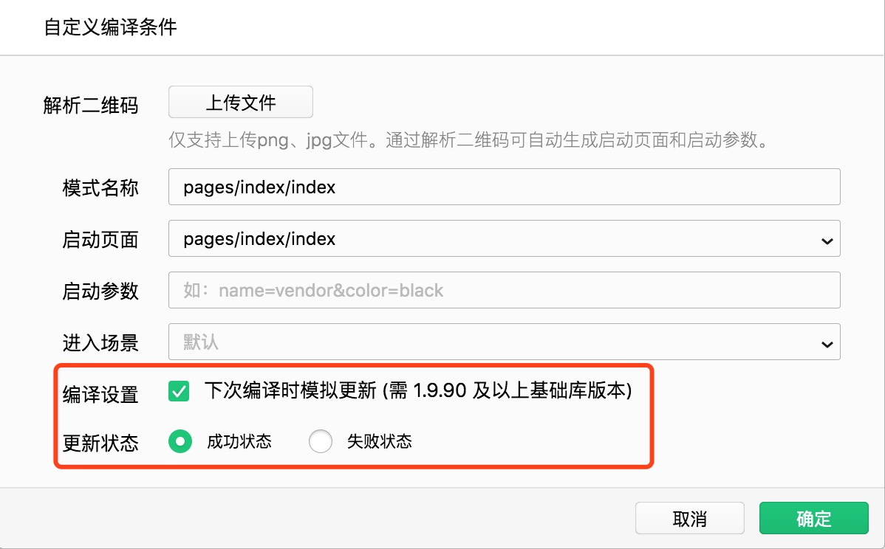

# 自动更新机制

## 前言

小程序的更新机制与它的运行机制有关。

为了保证用户能尽可能快得打开小程序，只会在后台更新，不会主动等待更新完毕才进入最新版小程序。

## 运行机制

首先，先看下小程序的运行机制：



与APP的概念有些类似，初次打开即为冷启动，若启动之后，在被系统回收之前再次打开，则称之为热启动。

## 更新机制

小程序的更新机制分为：

- 未启动时更新
- 启动时更新

**未启动时更新**：意味着微信客户端会在用户不在访问小程序期间，主动触发更新，最慢24小时内覆盖所有用户。如果用户在未覆盖期间进入小程序，则触发了启动时更新。

**启动时更新**：用户冷启动进入小程序时，均会检测小程序是否有更新版本，若有则后台默默更新，准备为下次冷启动时使用。需要注意的是，此时访问的仍是旧版本的小程序。如果此时想手动使用新版小程序，则可以使用官方API：

```js
const updateManager = wx.getUpdateManager()

updateManager.onCheckForUpdate(function (res) {
  // 请求完新版本信息的回调
  console.log(res.hasUpdate)
})

updateManager.onUpdateReady(function () {
  wx.showModal({
    title: '更新提示',
    content: '新版本已经准备好，是否重启应用？',
    success(res) {
      if (res.confirm) {
        // 新的版本已经下载好，调用 applyUpdate 应用新版本并重启
        updateManager.applyUpdate()
      }
    }
  })
})

updateManager.onUpdateFailed(function () {
  // 新版本下载失败
})
```

> 如若用户是第一次打开小程序（即新用户），则会直接打开最新版本的小程序。此时不需要考虑更新机制。

根据微信提供的能力，小程序的更新流程大致如下：



由于官方API没有提供主动下载新版本小程序的能力，仅提供了检测的能力。因此，当新版本下载失败时，没法主动触发重试，只能让用户继续访问旧版本的小程序。

下载失败之后，小程序的重试机制不得而知。可能需要等待小程序被销毁之后，再次冷启动时才会再次主动更新；又或者等待24小时之后。

由于可能存在下载新版本失败的用户，因此小程序的后端服务需要考虑向后兼容。另外，可以在下载失败的回调函数里加入数据统计，用于计算更新失败的概率。

## 测试

更新机制的测试工作比较麻烦，因为可能要上生产环境测试，风险极大。

笔者尝试在体验版上做测试：先打开`v0.0.1`版本的小程序，然后在开发者工具上传新的版本，再通过最近访问的列表里再次打开小程序，结果发现直接打开的就是`v0.0.2`，根本没有还原小程序的更新机制。

因此可以得出结论：**体验版无法测试更新机制**。

### 模拟更新

另外，开发者工具的编译模式提供模拟更新：



## 兼容处理

由于存在用户访问旧版小程序的可能，因此与后端的接口设计需要特别关注，尤其是在更新接口时，如果没有做到向后兼容，则会出现旧前端访问新后端的现象，从而产生不可预期的后果。

最简单的方式：每次升级接口时，均采用新接口。